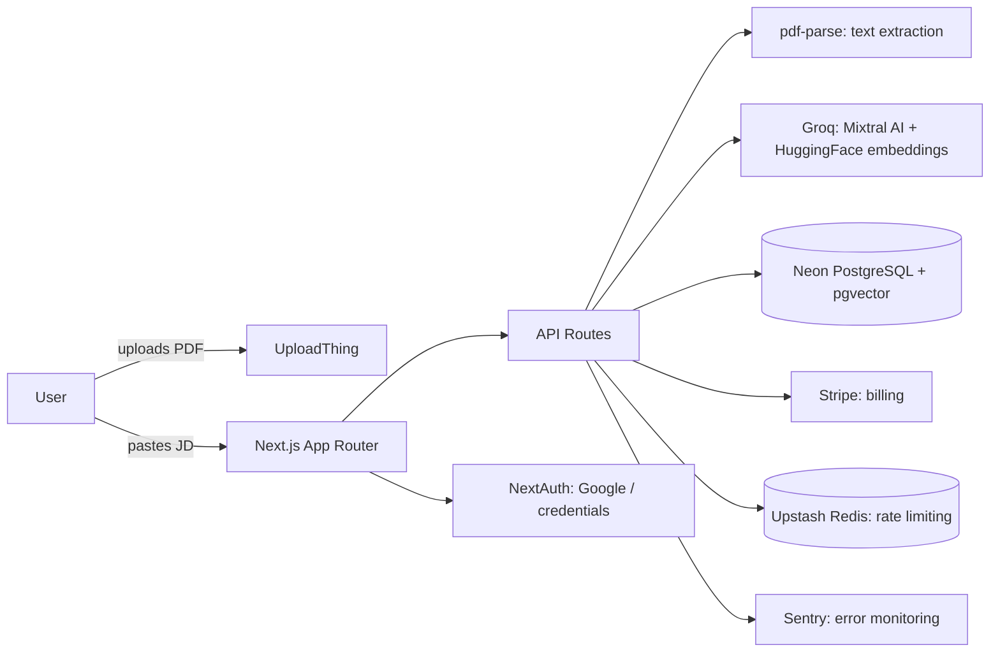

# Résona

Your resume, aligned to every opportunity.

Résona is an AI-powered resume and job-match platform: upload your resume, paste a job description, and get a semantic match score, a gap analysis, AI-rewritten resume sections, and a ready-to-send cover letter — plus a kanban tracker for every application you send.

**Live demo:** [resona-job-match.vercel.app](https://resona-job-match.vercel.app) — login `demo@resona.dev` / `demo-password-2026`

## Why this exists

75% of resumes are rejected by ATS software before a human ever reads them. Most resume tools optimize for keyword stuffing. Résona instead uses semantic embeddings to understand *meaning*, not just matching words — the same resume phrased differently can score very differently depending on how well it actually maps to the role.

## Features

- **Semantic match scoring** — Groq (Mixtral) analysis + HuggingFace embeddings cosine similarity, not keyword counting
- **Gap detection** — AI identifies exactly which skills from the job description are missing
- **AI section rewriting** — before/after comparison, factually grounded in your original content
- **Cover letter generation** — tailored to the specific role and company
- **Application tracker** — kanban board (Applied → Interview → Offer → Rejected)
- **Stripe billing** — Free / Pro plans with usage-based quotas
- **i18n** — English and French
- **Full test suite** — unit, integration, and e2e coverage with CI

## Architecture



## Stack

| Layer | Choice |
|---|---|
| Framework | Next.js (App Router), TypeScript |
| Styling | Tailwind CSS v4 |
| Database | PostgreSQL (Neon) + pgvector |
| ORM | Prisma |
| Auth | NextAuth / Auth.js (email/password + Google) |
| AI | Groq (Mixtral 8x7b) + HuggingFace (all-MiniLM-L6-v2) |
| File storage | UploadThing |
| Payments | Stripe |
| Rate limiting | Upstash Redis |
| i18n | next-intl |
| Monitoring | Sentry |
| Testing | Vitest, Playwright |
| CI/CD | GitHub Actions, Vercel |

## Key decisions

- **Semantic matching over keyword matching** — the differentiator vs. most ATS-optimization tools, at the cost of higher API usage per analysis.
- **No color-coded status system** — matching/missing skills are distinguished by icon + label only, never green/red, to keep the visual language restrained and premium rather than "dashboard-y."
- **NextAuth over a managed auth provider** — full control over the auth flow, no vendor lock-in, at the cost of more upfront implementation.
- **Upstash Redis for rate limiting, not in-memory** — required for correctness on Vercel's stateless serverless functions.

## Running locally

```bash
git clone https://github.com/SaadaniMohamedAmine/resona-job-match.git
cd resona-job-match
npm install
cp .env.example .env.local
npx prisma db push
npm run db:seed
npm run dev
```

## Screenshots


---

Built by Mohamed Amine Saadani
