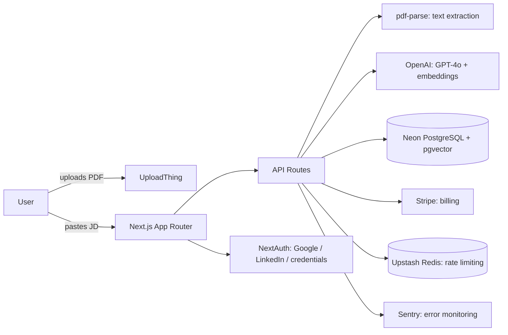

# Résona — Architecture

| | |
|---|---|
| **Status** | In development |
| **Last updated** | 2026-07-16 |
| **Related docs** | [PRD.md](./PRD.md) · [Data Models.md](./Data%20Models.md) · [API Contracts.md](./API%20Contracts.md) |

---

## 1. System Overview

Résona is a single Next.js application (frontend + backend colocated via API Routes), deployed on Vercel, backed by a single PostgreSQL database (Neon) that also serves as the vector store (pgvector) for semantic similarity — no separate vector database.

## 2. Technology Stack

| Layer | Choice | Rationale |
|---|---|---|
| Framework | Next.js (App Router), TypeScript | Server Components reduce client bundle for data-heavy pages (dashboard, results); one deployable unit for frontend + API |
| Styling | Tailwind CSS v4 (CSS-first `@theme`) | Design tokens (colors, fonts, radii) map directly to the Résona brand system, no separate CSS-in-JS runtime |
| Database | PostgreSQL (Neon), serverless | Autoscaling, branching for preview environments, native `pgvector` support |
| ORM | Prisma | Type-safe schema, migrations; `Unsupported("vector(1536)")` + raw SQL bridges the pgvector gap |
| Auth | NextAuth / Auth.js v5 | Full control over the auth flow (email/password + OAuth), no vendor lock-in vs. a managed auth provider |
| AI | OpenAI GPT-4o (analysis, rewriting, cover letters) + `text-embedding-3-small` (semantic similarity) | GPT-4o for structured, explainable output (JSON mode); embeddings for a second, independent semantic signal |
| File storage | UploadThing | Managed, secure PDF upload without owning S3-equivalent infra directly |
| Payments | Stripe (Checkout + customer portal + webhooks) | Industry standard, handles PCI compliance |
| Rate limiting | Upstash Redis + `@upstash/ratelimit` | Required for correctness on stateless Vercel serverless functions — an in-memory limiter would silently fail across invocations |
| i18n | next-intl | App Router-native, locale-prefixed routing |
| Monitoring | Sentry | Client + server + edge error capture |
| Testing | Vitest (unit/integration), Playwright (e2e) | Standard modern stack, fast feedback loop |
| CI/CD | GitHub Actions → Vercel | Lint/build/test gate on every PR, auto-deploy on merge to `main` |

## 3. Application Architecture

- **Routing:** Next.js App Router with a `[locale]` segment for i18n, route groups `(marketing)`, `(auth)`, `(app)` to separate public, auth, and authenticated product surfaces without affecting the URL structure.
- **Rendering strategy:** Server Components by default for data-fetching pages (Results, Dashboard, Resume history, Tracker's initial load), Client Components only where interactivity requires it (Upload dropzone, Rewrite tabs, Cover letter modal, Tracker drag-and-drop).
- **API layer:** Route Handlers under `app/api/`, one file per resource, each wrapped in a shared `withErrorHandling` helper that reports to Sentry and returns a consistent error shape (see [API Contracts.md](./API%20Contracts.md)).
- **Shared logic:** business logic (AI calls, embeddings, PDF parsing) lives in `lib/`, not inline in route handlers, so it's independently unit-testable (see Phase 5 test suite).

## 4. Database Architecture

Full schema, field-level detail, and relationships are documented in [Data Models.md](./Data%20Models.md). At a system level:

- Single Postgres database, single schema, no multi-tenancy beyond row-level `userId` scoping.
- `pgvector` extension enabled via a one-time raw SQL migration (`CREATE EXTENSION IF NOT EXISTS vector;`) — not something Prisma can express directly.
- Embeddings are stored as `vector(1536)` columns on `Resume` and `JobPost`, written via `$executeRawUnsafe` and queried via `$queryRawUnsafe` using the `<=>` cosine-distance operator, since Prisma Client has no native vector query builder.

## 5. AI Pipeline

1. PDF uploaded to UploadThing → text extracted server-side via `pdf-parse`.
2. Resume text + job description sent to GPT-4o (JSON mode) → structured `{ matchScore, matchingSkills, missingSkills, suggestions }`.
3. Resume text and job description independently embedded (`text-embedding-3-small`) and stored; cosine similarity available as a secondary signal, not currently surfaced directly in the UI but computed and stored for future use (e.g. semantic search across a user's own history).
4. Rewriting and cover-letter generation are separate, on-demand GPT-4o calls scoped to a single existing `Analysis` record — not re-run automatically.

## 6. Authentication & Authorization

- NextAuth v5, JWT session strategy, Prisma adapter.
- Providers: credentials (email + bcrypt-hashed password), Google OAuth, LinkedIn OAuth.
- No email verification step by design (friction reduction).
- Authorization is row-level: every API route re-derives the session server-side and checks `resource.userId === session.user.id` before returning or mutating data — there is no separate role/permission system in v1 beyond the `Plan` enum (`FREE` / `PRO`), which gates quotas and feature access rather than data visibility.

## 7. Third-Party Integrations

| Service | Purpose | Failure mode handling |
|---|---|---|
| OpenAI | Analysis, rewriting, cover letters, embeddings | Errors bubble to the shared error handler → 500 + Sentry capture; no automatic retry in v1 |
| Stripe | Checkout, subscription lifecycle, customer portal | Webhook signature verification required; unhandled event types are ignored, not errored |
| UploadThing | PDF storage | Upload failures surface client-side before an analysis is ever created |
| Upstash Redis | Rate limiting | If Redis is unreachable, requests should fail closed (reject) rather than open, to protect the OpenAI cost budget — implement accordingly, do not silently bypass the limiter on error |
| Sentry | Error monitoring | Client, server, and edge configs all point to the same DSN in v1 |

## 8. Deployment Strategy

- **Hosting:** Vercel, framework preset `nextjs`, build command `prisma generate && next build`.
- **Database:** Neon, with a separate branch/database for production vs. development, so schema changes can be tested against a preview branch before touching production data.
- **Environments:** `development` (local), `preview` (Vercel PR deployments, pointed at a Neon dev branch), `production` (Vercel `main`, pointed at the Neon production branch).
- **CI/CD:** GitHub Actions runs lint, build, and the full test suite (unit + e2e) on every PR; Vercel deploys `main` automatically on merge once CI is green.
- **Secrets:** managed via Vercel environment variables, distinct values per environment; production secrets (OpenAI, Stripe, OAuth) are rotated immediately before the first public deployment (see Phase 6 delegation doc for the full rotation checklist).
- **Seed data:** a dedicated seed script provisions a demo account (`demo@resona.dev`) with realistic sample data for public demo purposes, run manually against production once, not on every deploy.

## 9. Security Considerations

- All resume/job-description content is transmitted to OpenAI for processing — this is disclosed in the Privacy Policy.
- PDF uploads are restricted by file type and size (4MB max) at the UploadThing router level.
- Stripe webhook endpoint verifies signatures before processing any event.
- Rate limiting protects both cost (OpenAI usage) and abuse (credential stuffing on auth endpoints, handled separately via a general API rate limiter).
- No secrets are committed to the repository; `.env` is gitignored from the first commit.

## 10. Key Architectural Decisions

| Decision | Alternative considered | Why this choice |
|---|---|---|
| Semantic (embedding) similarity as a secondary signal, GPT-4o structured output as the primary score | Pure keyword-matching (like most ATS-optimization tools) | Differentiator: keyword matching rewards stuffing, not genuine fit |
| NextAuth/Auth.js over a managed auth provider (e.g. Clerk) | Clerk (suggested in the original brief) | Full control, no vendor lock-in, at the cost of more upfront implementation |
| Neon + pgvector, no separate vector DB | Pinecone / dedicated vector store | One database to operate; embedding volume at this scale doesn't justify a separate system |
| Upstash Redis for rate limiting | In-memory limiter | Vercel functions are stateless per invocation — in-memory state does not persist or synchronize across instances |
| No color-coded status system (icons + labels only) | Green/red status colors (as in the original brief) | Deliberate brand constraint — restrained, premium visual language over conventional dashboard UI |

## 11. Scalability & Performance Considerations

- GPT-4o calls are the primary latency and cost bottleneck (typically several seconds per analysis) — the "Analyzing" step UI exists specifically to make this latency feel intentional rather than broken.
- Database reads for Dashboard/Resume history are simple, indexed, `userId`-scoped queries — no N+1 risk at current scale.
- pgvector similarity search is not yet used at index scale (single-row lookups per analysis); if cross-user semantic search were added later, an IVFFlat or HNSW index on the `embedding` columns would become necessary.
