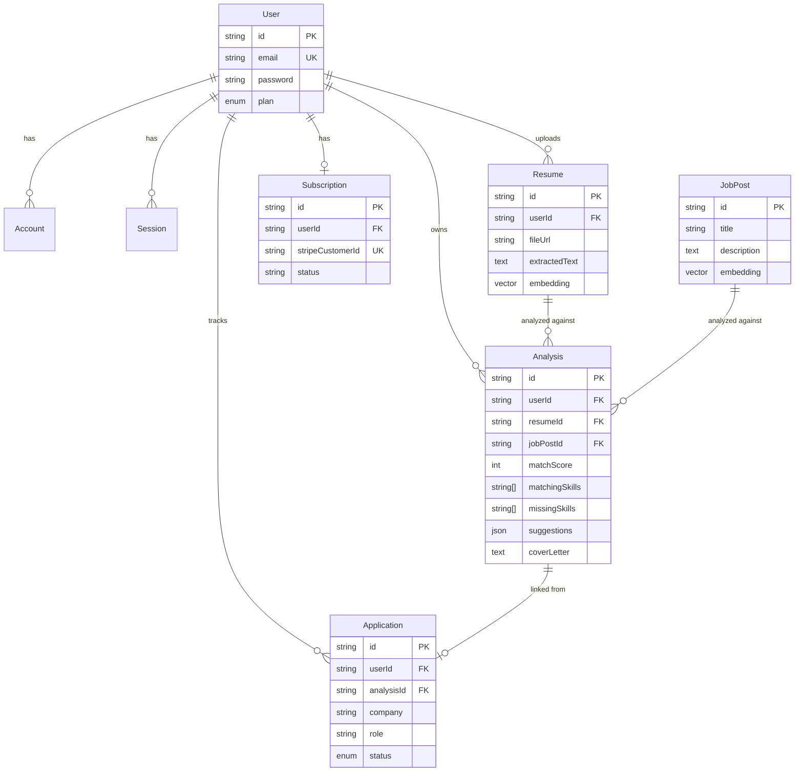

# Résona — Data Models

| | |
|---|---|
| **Database** | PostgreSQL (Neon) + `pgvector` extension |
| **ORM** | Prisma |
| **Last updated** | 2026-07-16 |
| **Related docs** | [Architecture.md](./Architecture.md) · [API Contracts.md](./API%20Contracts.md) |

---

## 1. Overview

Résona's data model has two halves: a standard NextAuth identity block (`User`, `Account`, `Session`) and the product domain (`Resume`, `JobPost`, `Analysis`, `Application`, `Subscription`). Every domain row is scoped to a single `User` via `userId` — there is no multi-tenancy or shared/team data in v1.

## 2. Entity-Relationship Diagram



## 3. Models

### 3.1 `User`

The core identity record. Extended beyond the default NextAuth shape with `password` (for credentials auth) and `plan` (billing tier).

| Field | Type | Notes |
|---|---|---|
| `id` | `String` (cuid) | Primary key |
| `name` | `String?` | Optional, set by user or OAuth provider |
| `email` | `String` | Unique, required |
| `emailVerified` | `DateTime?` | Present for NextAuth compatibility; unused in v1 (no verification flow) |
| `image` | `String?` | Avatar URL, typically from OAuth provider |
| `password` | `String?` | bcrypt hash; `null` for OAuth-only accounts |
| `plan` | `Plan` | `FREE` (default) or `PRO` |
| `createdAt` / `updatedAt` | `DateTime` | Standard timestamps |

**Relationships:** one-to-many with `Account`, `Session`, `Resume`, `Analysis`, `Application`; one-to-one with `Subscription`.

### 3.2 `Account` / `Session`

Standard NextAuth/Auth.js Prisma adapter shape — not application-specific. `Account` stores one row per linked OAuth provider (Google, LinkedIn) per user; `Session` backs the active session when using database session strategy (v1 uses JWT strategy by default, so these tables exist for adapter compatibility and future flexibility rather than being read on every request).

### 3.3 `Resume`

One row per uploaded resume file. A user can upload the same physical resume multiple times against different job descriptions — each upload is a distinct `Resume` row (no deduplication in v1).

| Field | Type | Notes |
|---|---|---|
| `id` | `String` (cuid) | Primary key |
| `userId` | `String` | FK → `User.id`, cascade delete |
| `fileUrl` | `String` | UploadThing-hosted PDF URL |
| `fileName` | `String` | Original filename, for display |
| `extractedText` | `Text` | Full text extracted via `pdf-parse` |
| `embedding` | `vector(1536)` | `Unsupported` Prisma type; written/read via raw SQL |
| `createdAt` | `DateTime` | |

**Relationships:** many-to-one with `User`; one-to-many with `Analysis`.

### 3.4 `JobPost`

One row per pasted job description. Not deduplicated across users or across repeated pastes — each analysis creates its own `JobPost` row.

| Field | Type | Notes |
|---|---|---|
| `id` | `String` (cuid) | Primary key |
| `title` | `String` | Required |
| `company` | `String?` | Optional |
| `description` | `Text` | Full pasted job description |
| `embedding` | `vector(1536)` | Same pattern as `Resume.embedding` |
| `createdAt` | `DateTime` | |

**Relationships:** one-to-many with `Analysis`.

### 3.5 `Analysis`

The central record — the output of one AI analysis run, linking exactly one `Resume` to exactly one `JobPost`.

| Field | Type | Notes |
|---|---|---|
| `id` | `String` (cuid) | Primary key |
| `userId` | `String` | FK → `User.id`, cascade delete |
| `resumeId` | `String` | FK → `Resume.id`, cascade delete |
| `jobPostId` | `String` | FK → `JobPost.id`, cascade delete |
| `matchScore` | `Int` | 0–100 |
| `matchingSkills` | `String[]` | Simple string list (v1 — not a normalized skills table) |
| `missingSkills` | `String[]` | Same |
| `suggestions` | `Json` | Array of `{ section, issue, recommendation }`, shape defined in [API Contracts.md](./API%20Contracts.md) |
| `coverLetter` | `Text?` | Populated on-demand, `null` until generated |
| `createdAt` | `DateTime` | |

**Relationships:** many-to-one with `User`, `Resume`, `JobPost`; one-to-one (optional) with `Application`.

> **Note on `matchingSkills`/`missingSkills` as string arrays:** v1 deliberately does not normalize skills into their own table with a many-to-many join. This is the correct tradeoff for the current feature set (skills are display-only, not queried/aggregated across users) — revisit only if a future feature needs cross-analysis skill aggregation or a skills taxonomy.

### 3.6 `Application`

One row per tracked job application, optionally originating from an `Analysis`.

| Field | Type | Notes |
|---|---|---|
| `id` | `String` (cuid) | Primary key |
| `userId` | `String` | FK → `User.id`, cascade delete |
| `analysisId` | `String?` | FK → `Analysis.id`, unique, `SetNull` on delete (an application survives its source analysis being deleted) |
| `company` | `String` | Required |
| `role` | `String` | Required |
| `status` | `ApplicationStatus` | `APPLIED` (default) / `INTERVIEW` / `OFFER` / `REJECTED` |
| `appliedAt` | `DateTime` | Defaults to creation time, editable in principle |
| `updatedAt` | `DateTime` | |

**Relationships:** many-to-one with `User`; one-to-one (optional) with `Analysis`.

### 3.7 `Subscription`

One row per user with billing history — created on first successful Stripe Checkout, updated by webhook events thereafter.

| Field | Type | Notes |
|---|---|---|
| `id` | `String` (cuid) | Primary key |
| `userId` | `String` | FK → `User.id`, unique, cascade delete |
| `stripeCustomerId` | `String` | Unique |
| `stripeSubscriptionId` | `String?` | Unique, `null` before first checkout completes |
| `stripePriceId` | `String?` | Current price/plan on Stripe's side |
| `status` | `String` | Mirrors Stripe subscription status (`active`, `canceled`, `past_due`, `trialing`) |
| `currentPeriodEnd` | `DateTime?` | Renewal/expiry date |
| `createdAt` / `updatedAt` | `DateTime` | |

**Relationships:** one-to-one with `User`.

## 4. Enums

```prisma
enum Plan {
  FREE
  PRO
}

enum ApplicationStatus {
  APPLIED
  INTERVIEW
  OFFER
  REJECTED
}
```

`User.plan` is the source of truth read by application code (rate limiter, feature gating); `Subscription.status` is Stripe's source of truth and is what keeps `User.plan` in sync via webhook — they are intentionally two separate fields rather than one, so the app never has to infer plan status from Stripe's richer subscription lifecycle at request time.

## 5. pgvector Notes

- Extension must be enabled once per database: `CREATE EXTENSION IF NOT EXISTS vector;` — not expressible in the Prisma schema itself, run as a manual migration step.
- `embedding` columns are declared as `Unsupported("vector(1536)")` in Prisma — Prisma Client cannot read/write them directly; all access goes through `$executeRawUnsafe` / `$queryRawUnsafe` (see `lib/ai/embeddings.ts`, Phase 2 delegation doc).
- 1536 dimensions matches `text-embedding-3-small` output size exactly — if the embedding model ever changes, this column width must change with it (no automatic migration).
- No vector index (IVFFlat/HNSW) exists in v1 — acceptable at current scale (single-row lookups per analysis), revisit if cross-analysis semantic search is added (see [Architecture.md](./Architecture.md) §11).

## 6. Full Prisma Schema

The canonical, authoritative schema (single source of truth — this document describes it, but the `.prisma` file is what's actually run) lives at `prisma/schema.prisma` and is reproduced in full in the Phase 1 delegation doc (`features/project-04-resona-phase-1-fondations-design-system.md`, §3.2).
